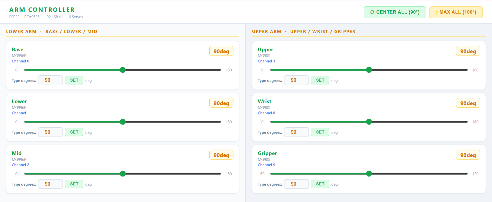

# 🤖 6-DOF Programmable Robotic Arm (ESP32 + WiFi Control)

A browser-controlled robotic arm built using **ESP32, PCA9685 PWM driver, and 6 servo motors**, designed for precise calibration and repeatable pick-and-place operations.

---

## ⚡ What This System Does

* Controls a **6-DOF robotic arm** in real time via WiFi
* Allows **joint-by-joint calibration using a browser interface**
* Executes a **repeatable pick-and-place sequence after calibration**
* Operates **without continuous user input once calibrated**

---

## 🎯 Problem Statement

Manual pick-and-place operations are:

* Slow and repetitive
* Prone to human error
* Not scalable in industrial environments

This project demonstrates a **low-cost programmable robotic arm** that automates such operations using embedded control and calibration logic.

---

## 🚀 Overview

The system consists of:

* **ESP32 microcontroller** → control + WiFi hosting
* **PCA9685 PWM driver** → multi-servo control
* **6 servo motors** → 6 degrees of freedom
* **Web-based UI** → real-time calibration

A key feature is the **WiFi-based control interface**, which allows tuning servo angles without repeatedly flashing firmware.

---

## 🧠 System Architecture

```text
User (Browser UI)
        ↓
WiFi (ESP32 SoftAP)
        ↓
ESP32 (Control Logic)
        ↓
I2C Communication
        ↓
PCA9685 PWM Driver
        ↓
Servo Motors (6 DOF)
        ↓
Robotic Arm Movement
```

---

## 🔄 How It Works

1. ESP32 boots and initializes PCA9685 (50Hz PWM)
2. ESP32 creates a WiFi hotspot
3. User connects and opens browser (192.168.4.1)
4. Sliders control each servo in real time
5. Angles are recorded for each position:

   * HOME, APPROACH, GRIP, LIFT, DROP
6. Values are stored in code
7. Arm executes a repeatable pick-and-place sequence

---

## 🖥️ Control Interface

The system uses a **browser-based UI hosted on ESP32**:

* No internet required
* No app installation
* Real-time control via sliders
* Displays live servo angles

📸 Example:



---

## ⚙️ Hardware Components

* ESP32 DevKit v1
* PCA9685 16-channel PWM driver
* Servo Motors:

  * MG996R × 3 (high torque)
  * MG90S × 3 (medium torque)
* 5V external power supply (3–4A)
* 3D-printed robotic arm frame

---

## 🔑 Key Features

* Real-time servo calibration via WiFi
* Multi-servo control using I2C PWM expansion
* Independent power and control circuits
* Repeatable motion execution
* Modular and scalable architecture

---

## 🧪 Results

* Successful execution of full pick-and-place sequence
* Stable operation across multiple cycles
* Accurate positioning after calibration
* Reliable WiFi-based control interface

---

## ⚠️ Challenges & Solutions

* **Servo jitter** → solved using delay tuning
* **Dead PWM channels** → remapped channels
* **ESP32 crashes** → moved UI to PROGMEM
* **I2C instability** → fixed with common ground
* **Voltage drop** → used dedicated 5V power supply

---

## 📁 Project Structure

```text
code/        → Arduino firmware
assets/      → images and diagrams
```

---

## 🔮 Future Improvements

* Add vision-based object detection
* Implement dynamic path planning
* Replace manual calibration with inverse kinematics
* Add feedback sensors (force / position)

---

## 📌 Note

This project was built as part of an **internship in Intelligent Robotics & AI Integration**, focusing on practical embedded system design and real-world debugging.

---

## 🙌 Acknowledgment

Developed during internship training conducted by iSpark Learning Solutions, focused on robotics, automation, and embedded systems.
