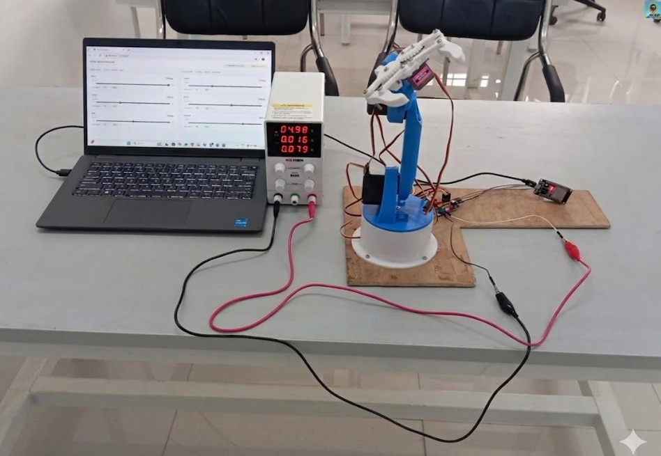
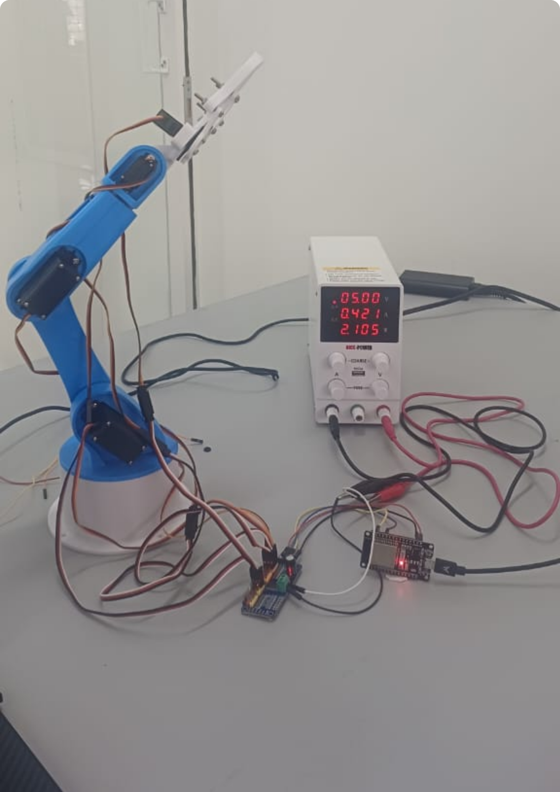
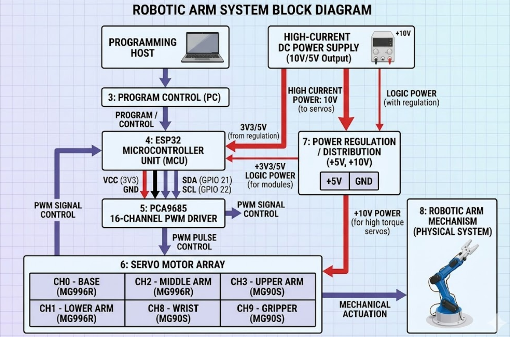

# 🤖 6-DOF Programmable Robotic Arm (ESP32 + WiFi Control)

🚀 Calibration-driven robotic system built in 5 days during an intensive robotics internship, focused on real hardware debugging and system integration

A browser-controlled robotic arm built using **ESP32, PCA9685 PWM driver, and 6 servo motors**, designed for precise calibration and repeatable pick-and-place operations.

---

## ⚡ What This System Does

* Controls a **6-DOF robotic arm** in real time via WiFi
* Enables **joint-by-joint calibration through a browser interface**
* Executes a **repeatable pick-and-place sequence after calibration**
* Operates **independently once calibrated (no continuous input required)**

---

## 🎯 Problem Statement

Manual pick-and-place operations are:

* Slow and repetitive
* Prone to human error
* Difficult to scale in low-cost setups

This project addresses these limitations by designing a **low-cost embedded robotic system** with a **calibration-based execution pipeline**, eliminating the need for complex programming or continuous control.

---

## 🚀 Overview

The system integrates:

* **ESP32 microcontroller** → control + WiFi hosting
* **PCA9685 PWM driver** → efficient multi-servo control via I2C
* **6 servo motors** → 6 degrees of freedom
* **Web-based UI** → real-time calibration interface

Instead of real-time manual control, the system follows a:

👉 **Calibration → Angle Storage → Automated Execution**

pipeline, enabling consistent and repeatable motion.

---

## 🧠 System Architecture

```text
User (Browser UI)
        ↓
WiFi (ESP32 SoftAP)
        ↓
ESP32 (Control Logic)
        ↓
I2C Communication
        ↓
PCA9685 PWM Driver
        ↓
Servo Motors (6 DOF)
        ↓
Robotic Arm Movement
```

---

## 📸 System Demonstration

### 🔧 Final Hardware Setup



---

### 🤖 Robotic Arm Assembly



---

### 🌐 WiFi Control Interface


---

### 🧠 Block Diagram



---

## 🔄 How It Works

1. ESP32 initializes PCA9685 (50Hz PWM for servo control)
2. Creates a WiFi hotspot for local control
3. User accesses UI via browser (`192.168.4.1`)
4. Sliders adjust servo angles in real time
5. Key positions are calibrated:

   * HOME → APPROACH → GRIP → LIFT → DROP
6. Angles are stored in firmware
7. System executes the sequence autonomously

---

## ▶️ How to Run

1. Upload firmware to ESP32 (Arduino IDE)
2. Connect PCA9685 via I2C

   * SDA → GPIO21
   * SCL → GPIO22
3. Provide external 5V supply to servos
4. Connect to ESP32 WiFi hotspot
5. Open `192.168.4.1` in browser
6. Calibrate joints using sliders
7. Upload final sequence for execution

---

## ⚙️ Hardware Components

* ESP32 DevKit v1
* PCA9685 16-channel PWM driver
* Servo Motors:

  * MG996R × 3 (high torque)
  * MG90S × 3 (medium torque)
* External 5V power supply (3–4A)
* 3D-printed robotic arm structure

---

## 🔑 Key Features

* Calibration-driven control (no continuous manual input)
* Multi-servo control via I2C PWM expansion
* Separation of control logic and power supply
* Repeatable motion execution pipeline
* Modular and extensible system design

---

## 🧪 Results

* Successful execution of complete pick-and-place sequence
* Stable behavior across repeated runs
* Consistent positioning after calibration
* Reliable WiFi-based control interface

---

## ⚠️ Challenges & Solutions

* **Servo jitter** → optimized delays and motion sequencing
* **Dead PWM channels** → channel remapping
* **ESP32 crashes** → moved UI to PROGMEM to reduce memory usage
* **I2C instability** → corrected grounding and wiring
* **Voltage drops** → used dedicated external power supply

---

## ⚠️ Limitations

* Open-loop system (no feedback sensors)
* Requires manual calibration per setup
* Accuracy depends on servo precision and mechanical alignment

---

## 📁 Project Structure

```text
code/        → Arduino firmware
assets/      → images and diagrams
```

---

## 🔮 Future Improvements

* Integrate vision-based object detection
* Implement inverse kinematics for dynamic control
* Add feedback sensors (force/position)
* Enable adaptive path planning

---

## 📌 Note

Built as part of an internship in **Intelligent Robotics & AI Integration**, with emphasis on practical embedded systems and real-world debugging.

---

## 🙌 Acknowledgment

Developed during internship training by iSpark Learning Solutions, focusing on robotics, automation, and embedded systems.
